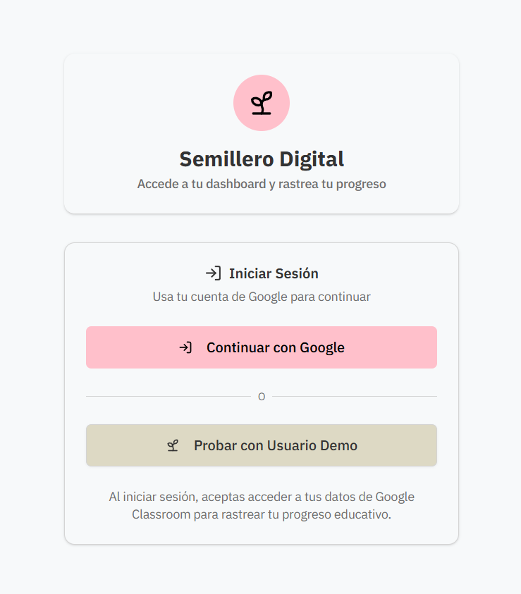
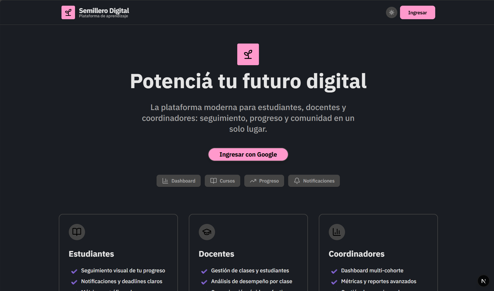
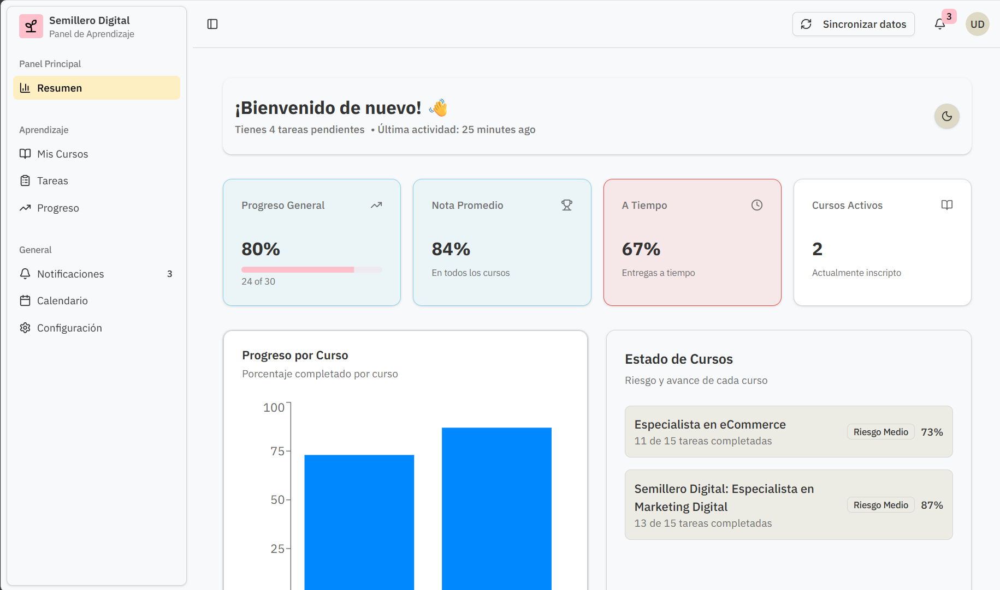
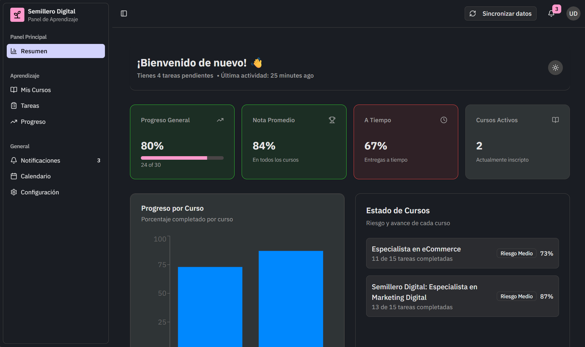
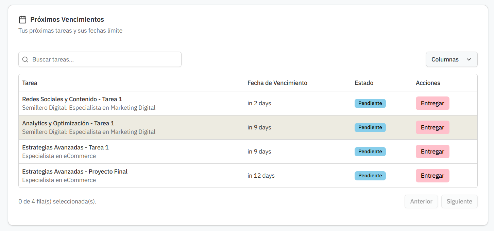
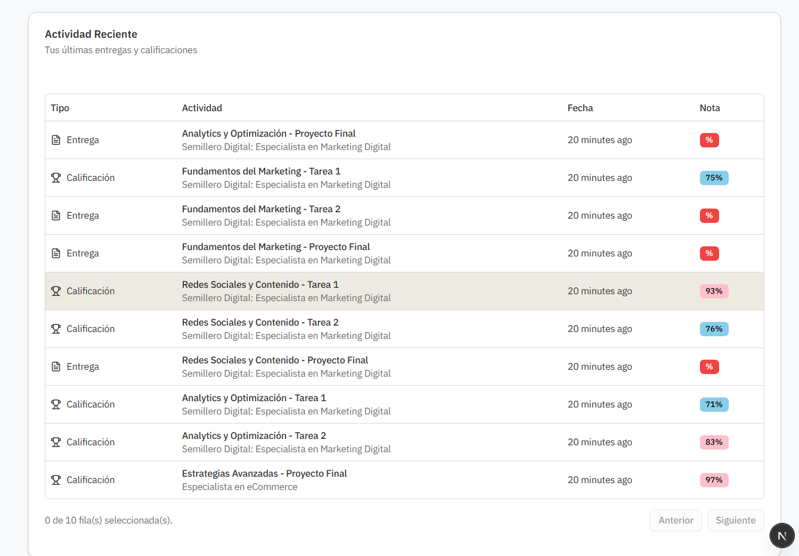
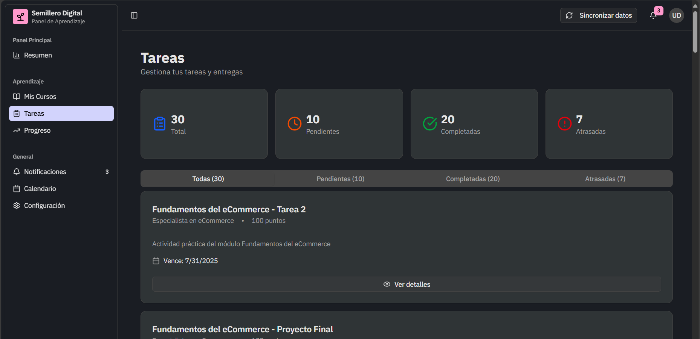
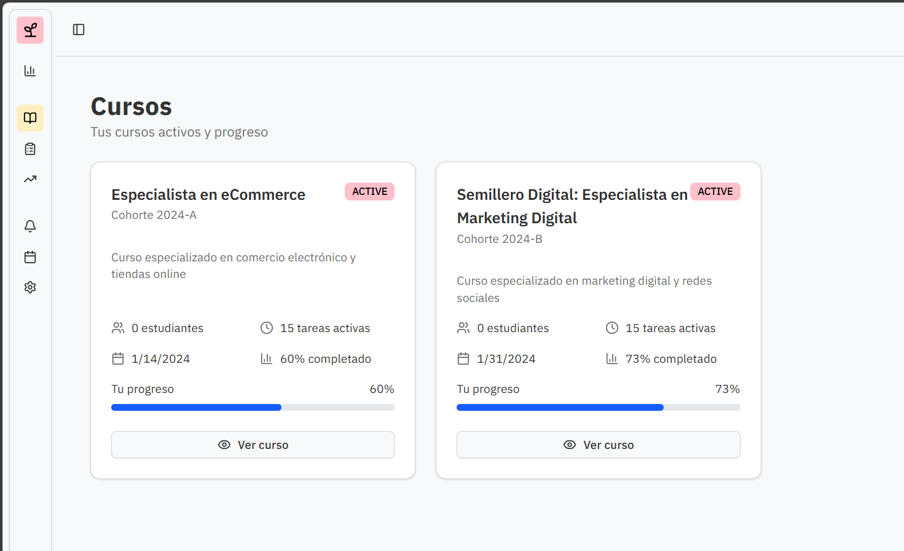
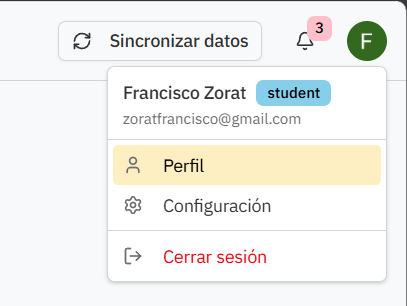
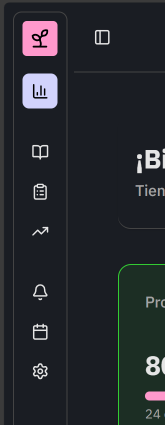

# Semillero Digital Dashboard

A complementary web application for Google Classroom that helps Semillero Digital (non-profit) track student progress, improve communication, and generate metrics for their digital skills training program for low-income youth.

## 🚀 Getting Started

### Prerequisites

- Node.js 20+ 
- pnpm
- PostgreSQL database

### Installation

1. Clone the repository
2. Install dependencies:
   ```bash
   pnpm install
   ```

3. Set up environment variables:
   ```bash
   cp .env.example .env
   ```
   Fill in the required values in `.env`

4. Set up the database:
   ```bash
   pnpm db:generate
   pnpm db:push
   ```

5. Seed the database with sample data:
   ```bash
   pnpm run db:seed
   ```
   
   After seeding, run this query to assign sample data to your logged-in user:
   ```sql
   update enrollments set user_id = '[LOGINUSERID]' where user_id in ('student_1', 'student_200');
   update submissions set student_id = '[LOGINUSERID]' where student_id in ('student_1', 'student_200');
   update student_progress set student_id = '[LOGINUSERID]' where student_id in ('student_1', 'student_200');
   ```
   Replace `[LOGINUSERID]` with your actual user ID from the database.

6. Run the development server:
   ```bash
   pnpm dev
   ```

Open [http://localhost:3000](http://localhost:3000) with your browser.

## 🛠 Tech Stack

- **Framework**: Next.js 15 (App Router, TypeScript)
- **Styling**: Tailwind CSS + ShadCN/UI
- **Authentication**: Better-Auth with Google OAuth
- **Database**: DrizzleORM + PostgreSQL
- **API Integration**: Google Classroom API
- **Icons**: Lucide React

## 👥 User Roles

- **Students**: View personal progress, assignments, notifications
- **Teachers**: Manage classes, track student progress, grade assignments
- **Coordinators**: Multi-class analytics, reports, system administration

## 📱 Screenshots

### Authentication


### Landing Page


### Dashboard Views





### Core Features



### UI Components



## 🎯 Core Features

### Student Features
- Personal progress dashboard
- Assignment timeline view
- Grade and feedback display
- Notification center
- Upcoming deadlines tracker

### Teacher Features
- Class roster management
- Student progress overview
- Assignment status tracking
- Quick communication tools
- Performance analytics per class

### Coordinator Features
- Multi-class dashboard
- Cohort performance metrics
- Teacher activity overview
- Data export capabilities
- System administration panel

## 📊 Database Schema

The application uses PostgreSQL with Drizzle ORM. Key entities include:

- **Users**: Authentication and role management
- **Courses**: Google Classroom course integration
- **Students**: Course enrollment tracking
- **Assignments**: Coursework from Google Classroom
- **Submissions**: Student assignment submissions
- **Progress**: Student completion tracking

## 🔗 API Integration

### Google Classroom API Scopes
- `classroom.courses.readonly`: Access course information
- `classroom.coursework.students.readonly`: View assignments
- `classroom.student-submissions.students.readonly`: Access submissions
- `classroom.rosters.readonly`: View class rosters
- `classroom.profile.emails`: User profile information

## 🔐 Environment Variables

See `.env.example` for all required environment variables:

- `DATABASE_URL`: PostgreSQL connection string
- `BETTER_AUTH_SECRET`: Authentication secret key
- `GOOGLE_CLIENT_ID`: Google OAuth client ID
- `GOOGLE_CLIENT_SECRET`: Google OAuth client secret

## 📁 Project Structure

```
src/
├── app/                    # Next.js App Router
│   ├── (dashboard)/       # Dashboard layouts
│   │   ├── student/       # Student dashboard
│   │   ├── teacher/       # Teacher dashboard
│   │   └── coordinator/   # Coordinator dashboard
│   └── api/               # API routes
├── components/            # React components
│   ├── dashboard/         # Dashboard-specific components
│   ├── auth/              # Authentication components
│   └── ui/                # ShadCN UI components
├── lib/                   # Utility libraries
│   ├── auth/              # Better-Auth configuration
│   ├── db/                # Database schema and connection
│   └── google/            # Google API services
└── types/                 # TypeScript type definitions
```

## 🗄 Database Commands

- `pnpm db:generate`: Generate migration files
- `pnpm db:push`: Push schema changes to database
- `pnpm db:migrate`: Run migrations
- `pnpm db:studio`: Open Drizzle Studio

## 📋 Development Scripts

- `pnpm dev`: Start development server with Turbopack
- `pnpm build`: Build for production
- `pnpm start`: Start production server
- `pnpm lint`: Run ESLint

## 🎨 Design System

Built with ShadCN/UI components using:
- Tailwind CSS for styling
- Radix UI primitives
- Lucide React for icons
- Clean, accessible interface for users with varying tech literacy
- Mobile-first responsive design

## 🔒 Security Features

- Secure OAuth implementation with Better-Auth
- Minimal Google API scopes required
- Data encryption and secure storage
- Role-based access control
- Protected API routes

## 📈 Success Metrics

- Improved student engagement through clear progress tracking
- Reduced missed assignments via better communication
- Streamlined administrative reporting for coordinators
- Enhanced teacher efficiency with consolidated dashboards

## 🤝 Contributing

This project is part of Semillero Digital's mission to provide digital skills training to low-income youth. When contributing, please keep the target audience in mind and prioritize accessibility and ease of use.

## 📜 License

This project is part of Semillero Digital's educational initiative.
